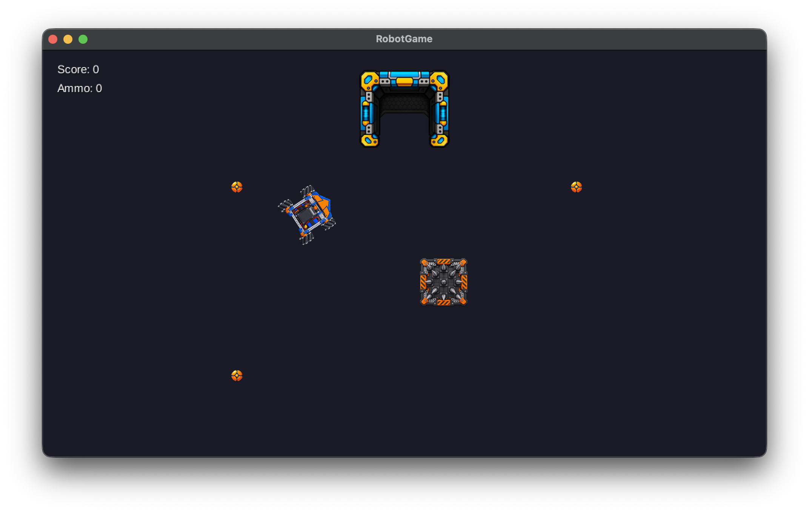
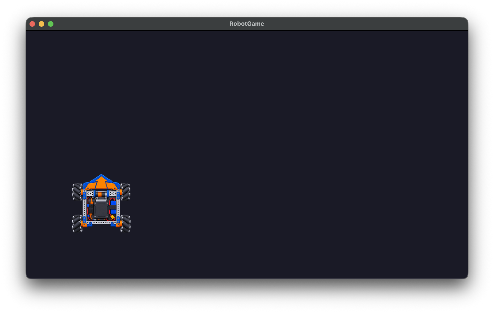

# Build a Robot Game. Learn Java for FTC.

Create a playable 2D robot game while learning Java, debugging, and drivetrain concepts that connect directly to FTC robotics.

**11 sessions · 90 minutes each · No Java experience required**

You will begin by moving one robot around the screen. By the final session, you will have built collisions, collectible balls, directional firing, scoring, and a four-wheel mecanum drive.

## What you will learn

- Use Java variables, conditionals, loops, methods, and classes to solve visible game problems.
- Work with coordinates, angles, vectors, and mecanum wheel-power calculations.
- Diagnose problems by observing the game, forming a hypothesis, and experimenting with the code.
- Build, run, and change a Java project in Android Studio.
- Save and share your work with Git and GitHub.

## Start small and build from there

In the first session, you draw a robot and make it move with the keyboard.

Each later session adds one meaningful capability. You will run the game frequently, see the effect of each change, and finish every session with a playable result.

## Course sessions

Read the [course outline](COURSE_OUTLINE.md) for an overview, then follow the tutorials in order:

1. [Make the Robot Move](sessions/session-1/TUTORIAL.md)
2. [Make Movement Consistent](sessions/session-2/TUTORIAL.md)
3. [Avoid Obstacles](sessions/session-3/TUTORIAL.md)
4. [Collect and Score](sessions/session-4/TUTORIAL.md)
5. [Fire Projectiles](sessions/session-5/TUTORIAL.md)
6. [Shoot into a Goal](sessions/session-6/TUTORIAL.md)
7. [Rotate the Robot](sessions/session-7/TUTORIAL.md)
8. [Drive in the Direction the Robot Faces](sessions/session-8/TUTORIAL.md)
9. [Aim and Fire in Any Direction](sessions/session-9/TUTORIAL.md)
10. [Drive with Mecanum Wheels](sessions/session-10/TUTORIAL.md)
11. [Normalize Wheel Powers](sessions/session-11/TUTORIAL.md)

## Getting started

The [Getting Started guide](GETTING_STARTED.md) is for self-paced learners who need to prepare Android Studio, clone the course, open and run the starter game, and save their progress with Git. If you are taking this course with an instructor, follow your instructor's setup directions instead.

## Reference games

Each reference game is a complete project showing the required result at the end of that session. Use one to compare your code with the expected result or to catch up before starting the next session.

1. [Session 1 reference game](reference-games/session-1/)
2. [Session 2 reference game](reference-games/session-2/)
3. [Session 3 reference game](reference-games/session-3/)
4. [Session 4 reference game](reference-games/session-4/)
5. [Session 5 reference game](reference-games/session-5/)
6. [Session 6 reference game](reference-games/session-6/)
7. [Session 7 reference game](reference-games/session-7/)
8. [Session 8 reference game](reference-games/session-8/)
9. [Session 9 reference game](reference-games/session-9/)
10. [Session 10 reference game](reference-games/session-10/)
11. [Session 11 reference game](reference-games/session-11/)

## License

Copyright 2026 Kevin Baca

Licensed under the [Apache License, Version 2.0](LICENSE). Existing third-party components retain their original licenses and copyright notices.
