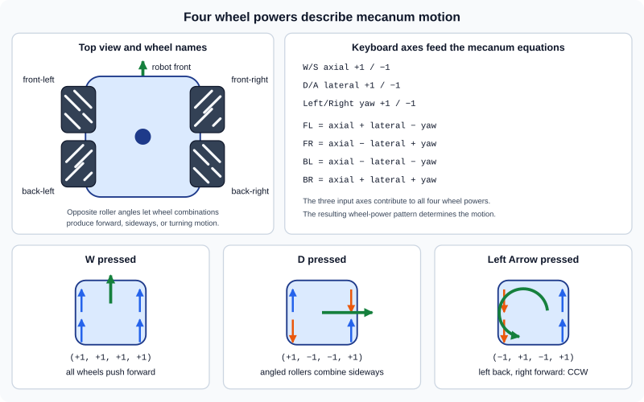

# Session 10 — Drive with Mecanum Wheels

In this session, the robot will move using four mecanum wheel powers: front-left, front-right, back-left, and back-right. The controls and visible game will stay familiar, but the drivetrain code will become much closer to the power flow used by an FTC robot.

Keep using this cycle:

```text
predict -> edit -> run -> observe
```

When surrounding code is shown, copy only the code in the first, copy-only block. The second block shows where that code belongs.

## 1. Start from your working game

Use Android Studio to pull any instructor updates, then open:

```text
core/src/main/java/org/ftcgame/RobotGame.java
```

Run the game and confirm that:

- W/S drive forward and backward relative to the robot;
- A/D strafe left and right relative to the robot;
- Left and Right Arrow rotate the robot;
- collected balls become ammunition;
- projectiles fire from the robot's front and keep their original direction;
- obstacle hits, goal scoring, and off-screen removal work;
- holding H displays the axis-aligned robot and obstacle hitboxes.

Stop the game before editing.

> **Checkpoint:** The completed Session 9 game works before the drivetrain changes.

## 2. Follow the power path

The current `moveRobot(...)` method reads the keyboard and directly changes `robotX`, `robotY`, and `robotRotation`. A mecanum controller can instead describe input with three axes:

- **axial** means movement along the robot's front-to-back centerline, so it controls driving forward and backward;
- **lateral** means movement across the robot from side to side, so it controls strafing right and left;
- **yaw** means rotation around the robot's center, so it controls clockwise and counterclockwise turning without changing position by itself. Positive yaw means counterclockwise, matching the positive rotation direction already used by `robotRotation`.

W/S control axial input, D/A control lateral input, and Right/Left Arrow control yaw input. Those three keyboard input values will be combined to calculate the power applied to each wheel.

We will change the path from input to movement:

```text
keyboard -> axial, lateral, yaw -> four wheel powers -> robot movement
```

A **kinematic** calculation describes how motions relate. It does not calculate forces, friction, or wheel contact with the floor. This game will use mecanum kinematics.

## 3. Store four wheel powers

In `RobotGame.java`, add these four member variables immediately below `robotRotation`:

```java
private float frontLeftPower = 0;
private float frontRightPower = 0;
private float backLeftPower = 0;
private float backRightPower = 0;
```

Your robot state should now look like this:

```java
private float robotX = ROBOT_START_X;
private float robotY = ROBOT_START_Y;
private float robotRotation = 0;
private float frontLeftPower = 0;
private float frontRightPower = 0;
private float backLeftPower = 0;
private float backRightPower = 0;
private float obstacleX = OBSTACLE_START_X;
```

Each power will stay between `-1` and `1` after normalization:

- `1` means full power in one direction;
- `-1` means full power in the opposite direction;
- `0` means stopped.

The fields use `float`, matching the other game state and providing more than enough precision for powers between `-1` and `1`. They are member variables because one method will calculate them and another method will use them.

## 4. Calculate wheel powers from three axes

The input code uses compact assignment operators. `+=` adds the value on the right to a variable, so `axial += 1;` means the same thing as `axial = axial + 1;`. Similarly, `-=` subtracts the value on the right.

Add this complete method immediately before `moveRobot(...)`:

```java
private void updateWheelPowers() {
    float axial = 0;
    float lateral = 0;
    float yaw = 0;

    if (Gdx.input.isKeyPressed(Input.Keys.W)) {
        axial += 1;
    }

    if (Gdx.input.isKeyPressed(Input.Keys.S)) {
        axial -= 1;
    }

    if (Gdx.input.isKeyPressed(Input.Keys.A)) {
        lateral -= 1;
    }

    if (Gdx.input.isKeyPressed(Input.Keys.D)) {
        lateral += 1;
    }

    if (Gdx.input.isKeyPressed(Input.Keys.LEFT)) {
        yaw += 1;
    }

    if (Gdx.input.isKeyPressed(Input.Keys.RIGHT)) {
        yaw -= 1;
    }

    frontLeftPower = axial + lateral - yaw;
    frontRightPower = axial - lateral + yaw;
    backLeftPower = axial - lateral - yaw;
    backRightPower = axial + lateral + yaw;
}
```

The new method should sit between projectile drawing and robot movement:

```java
private void drawProjectiles() {
    // Draw every projectile.
}

private void updateWheelPowers() {
    // Read axial, lateral, and yaw input, then calculate wheel powers.
}

private void moveRobot(float deltaTime) {
```

The three local input variables begin at zero every frame, so releasing every control stops the wheels. Opposite keys cancel naturally: pressing both W and S adds one to and subtracts one from `axial`, leaving it at zero.

The four equations convert axial, lateral, and yaw input into wheel powers. Their signs differ because mecanum wheels occupy different corners of the robot chassis and have differently angled rollers. For the given key press the code produces the following wheel powers:

| Key | Front-left | Front-right | Back-left | Back-right |
|---|---:|---:|---:|---:|
| W | `1` | `1` | `1` | `1` |
| D | `1` | `-1` | `-1` | `1` |
| Left Arrow | `-1` | `1` | `-1` | `1` |

S, A, and Right Arrow reverse every sign in the matching row. Left Arrow makes `yaw` positive (counterclockwise), matching positive `robotRotation`. Right Arrow makes `yaw` negative (clockwise).



*Positive power drives a wheel toward the robot's front, negative power drives it toward the back, and the four-wheel pattern determines the resulting motion.*

Do not call the method or run yet. The wheel powers exist, but movement does not use them.

## 5. Update the powers every frame

In `render()`, add this call immediately before the existing previous-position variables:

```java
updateWheelPowers();
```

The calls after clearing the screen should now look like this:

```java
ScreenUtils.clear(0.1f, 0.1f, 0.15f, 1);

updateWheelPowers();

float previousRobotX = robotX;
float previousRobotY = robotY;

moveRobot(deltaTime);

if (isRobotTouching(obstacleX, obstacleY, OBSTACLE_SIZE)) {
```

The new method now calculates four powers every frame, but the old `moveRobot(...)` still reads the same keys directly. Running at this point would look unchanged. Next, wheel powers will become the only input to movement.

## 6. Calculate the motion produced by the wheels

> **This section is game-only code.** On a real robot, the program applies the four powers to motors, and the powered wheels physically move and turn the chassis. The robot program does not need to calculate that motion back from the wheel powers.
>
> Our game has no physical motors, wheels, or floor. It must calculate the motion described by the four powers so it can update `robotX`, `robotY`, and `robotRotation` and draw the robot in its new location. These calculations stand in for the physical drivetrain; they do not simulate forces or friction.

The game must calculate the motion produced by the four powered wheels. Adding particular wheel combinations and dividing by four finds the axial, lateral, and yaw parts of that motion:

```text
axial   = (front-left + front-right + back-left + back-right) / 4
lateral = (front-left - front-right - back-left + back-right) / 4
yaw     = (-front-left + front-right - back-left + back-right) / 4
```

The parts that do not belong to the resulting motion cancel each other. For example, a pure right strafe uses `(1, -1, -1, 1)`. In the axial calculation, those values add to zero. In the lateral calculation, the signs turn all four contributions positive, and dividing by four returns one.

Replace the complete `moveRobot(...)` method with:

```java
private void moveRobot(float deltaTime) {
    double axialMovement = (
        frontLeftPower + frontRightPower
            + backLeftPower + backRightPower
    ) / 4;
    double lateralMovement = (
        frontLeftPower - frontRightPower
            - backLeftPower + backRightPower
    ) / 4;
    double yawMovement = (
        -frontLeftPower + frontRightPower
            - backLeftPower + backRightPower
    ) / 4;

    robotRotation = (float) (
        robotRotation + yawMovement * ROBOT_ROTATION_SPEED * deltaTime
    );

    double angleRadians = Math.toRadians(robotRotation);
    double sine = Math.sin(angleRadians);
    double cosine = Math.cos(angleRadians);

    double directionX = -sine * axialMovement
        + cosine * lateralMovement;
    double directionY = cosine * axialMovement
        + sine * lateralMovement;

    robotX = (float) (robotX + directionX * ROBOT_SPEED * deltaTime);
    robotY = (float) (robotY + directionY * ROBOT_SPEED * deltaTime);
}
```

The replacement method should remain between wheel-power calculation and hitbox drawing:

```java
private void updateWheelPowers() {
    // Calculate four wheel powers.
}

private void moveRobot(float deltaTime) {
    // Calculate and apply the motion produced by the wheels.
}

private void drawHitboxes() {
```

The old method calculated `directionX` and `directionY` separately inside four key checks. The replacement combines the motion produced by the wheels in two equations:

```text
screen x direction = -sine × axial movement + cosine × lateral movement
screen y direction =  cosine × axial movement + sine × lateral movement
```

Axial and lateral are the same forward and strafe contributions used in Session 8, now given concise names. Positive yaw and positive `robotRotation` both mean counterclockwise, so the rotation calculation adds `yawMovement`. Turning still uses rotation speed and delta time.

### Run it now

Run the game and test one control at a time:

1. At `0°`, W drives up and D strafes right.
2. Left Arrow turns counterclockwise and Right Arrow turns clockwise.
3. At approximately `90°`, W drives screen-left and D strafes screen-up.
4. W and D together move diagonally.

All controls should retain their earlier meanings. However, the robot can still translate unusually quickly when commands are combined. The wheel-power values will reveal why.

> **Checkpoint:** Robot translation and rotation now come from four wheel powers, while the visible controls still behave as before.

## 7. Inspect the wheel-power patterns

At the end of `updateWheelPowers()`, temporarily add this log:

```java
Gdx.app.log("WHEELS", "FL=" + frontLeftPower
    + " FR=" + frontRightPower
    + " BL=" + backLeftPower
    + " BR=" + backRightPower);
```

The log should sit after the four wheel-power equations and before the method's closing brace:

```java
frontLeftPower = axial + lateral - yaw;
frontRightPower = axial - lateral + yaw;
backLeftPower = axial - lateral - yaw;
backRightPower = axial + lateral + yaw;

Gdx.app.log("WHEELS", "FL=" + frontLeftPower
    + " FR=" + frontRightPower
    + " BL=" + backLeftPower
    + " BR=" + backRightPower);
}
```

Before pressing each key, predict the four values from the table. Run the game and check:

- W produces `(1, 1, 1, 1)`;
- D produces `(1, -1, -1, 1)`;
- Left Arrow produces `(-1, 1, -1, 1)`;
- W and D together produce `(2, 0, 0, 2)`.

The combined key presses ask two wheels for power `2`. A real motor command must remain in the range from `-1` to `1`. Simply changing each `2` to `1` would alter some combinations more than others. Instead, all four powers need to be scaled together.

Remove the temporary log before continuing.

## 8. Test the complete game

Before saving your work, verify every required behavior:

1. W/S drive forward and backward relative to the robot.
2. A/D strafe left and right relative to the robot.
3. Left and Right Arrow turn in their established directions.
4. `updateWheelPowers()` calculates front-left, front-right, back-left, and back-right powers.
5. `moveRobot(...)` derives axial, lateral, and yaw motion from wheel powers and does not read movement keys.
6. Translation and rotation still use delta time.
7. W, D, Left Arrow, and W+D produce the predicted wheel-power patterns.
8. Robot-obstacle edge stopping, collecting, firing, scoring, and projectile removal retain their Session 9 behavior.
9. Holding H still displays the robot and obstacle hitboxes.
10. No temporary wheel-power log remains.

Ask for help if any check fails. Test one command at a time, predict the four powers, and compare the log pattern before changing a formula. Fix the game and repeat the checklist before committing.

## 9. Commit and push

Use Android Studio's Git tools:

1. Open the Commit window.
2. Confirm that `RobotGame.java` is the Java file you changed.
3. Review the highlighted changes.
4. Enter this commit message:

   ```text
   Add mecanum wheel powers
   ```

5. Commit the changes.
6. Push the commit to your assigned GitHub repository.

> **Final checkpoint:** The finished game works, and the `Add mecanum wheel powers` commit has been pushed.

## Optional customizations

If you finish early, make one change at a time:

- use the temporary log to predict and inspect another two-key combination, then remove it;
- change `ROBOT_SPEED` or `ROBOT_ROTATION_SPEED` while preserving the drivetrain methods;
- replace `robot.png` with another 128×128 transparent robot image at the same path.

Keep the four wheel-power fields, axial/lateral/yaw equations, and existing public gameplay behavior unchanged for later sessions.
