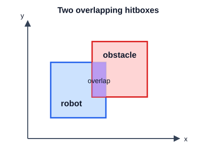

# Session 3 — Avoid Obstacles

In this session, you will add an obstacle that stops the robot when the two objects collide. Keep using the same cycle:

```text
predict -> edit -> run -> observe
```

## 1. Start from your working game

Use Android Studio to pull any instructor updates, then open:

```text
core/src/main/java/org/ftcgame/RobotGame.java
```

Run the game and confirm that W/A/S/D movement is consistent at different frame rates and uses the named robot constants.

> **Checkpoint:** The completed Session 2 game runs correctly.

## 2. Add an obstacle texture

The obstacle used below is the 128×128 runtime image `assets/obstacles/spikes.png`.

Add this variable immediately below `robotTexture`:

```java
private Texture obstacleTexture;
```

Your texture variables should now look like this:

```java
private SpriteBatch batch;
private Texture robotTexture;
private Texture obstacleTexture;

private static final float ROBOT_SPEED = 250;
```

Drawing and collision both use the robot and obstacle sizes, so they also need named constants.  Add these size constants immediately below the texture variables and above `ROBOT_SPEED`:

```java
private static final int ROBOT_SIZE = 64;
private static final int OBSTACLE_SIZE = 64;
```

The resource and constant fields should now begin like this:

```java
private SpriteBatch batch;
private Texture robotTexture;
private Texture obstacleTexture;

private static final int ROBOT_SIZE = 64;
private static final int OBSTACLE_SIZE = 64;
private static final float ROBOT_SPEED = 250;
```

The two sizes have separate names even though their current values match. This enables later changing `ROBOT_SIZE` without also changing the size of the obstacle.

Then load the obstacle in `create()` immediately after the robot texture:

```java
obstacleTexture = new Texture("obstacles/spikes.png");
```

After loading the obstacle, `create()` should look like this:

```java
@Override
public void create() {
    batch = new SpriteBatch();
    robotTexture = new Texture("robot.png");
    obstacleTexture = new Texture("obstacles/spikes.png");
}
```

Text between quotation marks is a Java **string**. Here it contains the location of the image file on the hard disk.

`new Texture(...)` creates a `Texture` object and loads that image identified in the string.  An **object** is one value created from a class;  `=` stores it in `obstacleTexture`.

Finally, add this line to `dispose()`:

```java
obstacleTexture.dispose();
```

The cleanup method should now include the obstacle texture:

```java
@Override
public void dispose() {
    batch.dispose();
    robotTexture.dispose();
    obstacleTexture.dispose();
}
```

Textures use graphics memory, so every loaded texture must be disposed when the game closes in order to free up the graphics memory for other uses.

### Run it now

Run the game. It should behave exactly as it did before. Loading an image does not automatically draw it.

> **Checkpoint:** The game still opens and moves without an error after loading the obstacle texture.

## 3. Give the obstacle a position

Add these starting-position constants with the other constants:

```java
private static final float OBSTACLE_START_X = 500;
private static final float OBSTACLE_START_Y = 200;
```

Then add the obstacle position fields below the robot position fields:

```java
private float obstacleX = OBSTACLE_START_X;
private float obstacleY = OBSTACLE_START_Y;
```

The starting-position constants and position fields should now look like this:

```java
private static final float ROBOT_START_X = 100;
private static final float ROBOT_START_Y = 100;
private static final float OBSTACLE_START_X = 500;
private static final float OBSTACLE_START_Y = 200;

private float robotX = ROBOT_START_X;
private float robotY = ROBOT_START_Y;
private float obstacleX = OBSTACLE_START_X;
private float obstacleY = OBSTACLE_START_Y;
```

These values place the obstacle away from the robot's starting position.

The existing `batch.draw(robotTexture, robotX, robotY)` call uses the texture file's original width and height. We will now supply the width and height explicitly so `OBSTACLE_SIZE` and `ROBOT_SIZE` control the visible sprites as well as the collision calculations we will add next. If you later change one of these constants, that object's sprite and hitbox will change together instead of drifting out of sync.

Inside the drawing section of `render()`, draw the obstacle before drawing the robot:

```java
batch.draw(obstacleTexture, obstacleX, obstacleY, OBSTACLE_SIZE, OBSTACLE_SIZE);
```

Change the robot drawing line from:

```java
batch.draw(robotTexture, robotX, robotY);
```

to:

```java
batch.draw(robotTexture, robotX, robotY, ROBOT_SIZE, ROBOT_SIZE);
```

The drawing section should now look like this:

```java
batch.begin();
batch.draw(obstacleTexture, obstacleX, obstacleY, OBSTACLE_SIZE, OBSTACLE_SIZE);
batch.draw(robotTexture, robotX, robotY, ROBOT_SIZE, ROBOT_SIZE);
batch.end();
```

### Run it now

Run the game. You should see one spiked obstacle near the middle of the window. The robot can still drive over it because the game does not check for contact yet.

The robot now appears smaller because `ROBOT_SIZE` is smaller than the texture's original width and height.

> **Checkpoint:** One obstacle appears, and its coordinates control its position.

## 4. Describe contact with comparisons

For collision detection, the game treats the robot as a `ROBOT_SIZE`-wide square and the obstacle as an `OBSTACLE_SIZE`-wide square. Each square is a **hitbox**: the area the game checks for contact. The robot and obstacle hitboxes overlap when all four of these statements are true:

```text
robot's left edge is left of obstacle's right edge
robot's right edge is right of obstacle's left edge
robot's bottom edge is below obstacle's top edge
robot's top edge is above obstacle's bottom edge
```



In Java, those comparisons are:

```java
robotX < obstacleX + OBSTACLE_SIZE
robotX + ROBOT_SIZE > obstacleX
robotY < obstacleY + OBSTACLE_SIZE
robotY + ROBOT_SIZE > obstacleY
```

`<` means "less than," and `>` means "greater than." Each comparison produces either `true` or `false`.

One comparison is not enough. The hitboxes overlap only when every comparison is true at the same time. Java's `&&` operator means **and**, so it combines the four conditions.

## 5. Stop the robot at the obstacle

The game checks collision after movement. Before moving, save the robot's current position in two local variables. Add these lines immediately before the first movement `if` statement:

```java
float previousRobotX = robotX;
float previousRobotY = robotY;
```

Copy only the two lines above. Your movement code should now begin like this:

```java
float previousRobotX = robotX;
float previousRobotY = robotY;

if (Gdx.input.isKeyPressed(Input.Keys.W)) {
    robotY = robotY + ROBOT_SPEED * deltaTime;
}
```

These variables remember where the robot was before this frame's movement. They will help the game determine which side of the obstacle the robot approached.

The collision response will happen in this order:

```text
remember position -> move -> detect overlap -> remove overlap -> draw
```

The four comparisons from the previous section perform **collision detection**: they answer whether the hitboxes overlap. When they report an overlap, the game must perform **collision resolution** by moving the robot out of the overlap and leaving its edge touching the obstacle.

In `render()`, add this `if` statement after all four movement statements and before `batch.begin()`:

```java
if (robotX < obstacleX + OBSTACLE_SIZE &&
    robotX + ROBOT_SIZE > obstacleX &&
    robotY < obstacleY + OBSTACLE_SIZE &&
    robotY + ROBOT_SIZE > obstacleY) {
    if (previousRobotX + ROBOT_SIZE <= obstacleX) {
        robotX = obstacleX - ROBOT_SIZE;
    } else if (previousRobotX >= obstacleX + OBSTACLE_SIZE) {
        robotX = obstacleX + OBSTACLE_SIZE;
    } else if (previousRobotY + ROBOT_SIZE <= obstacleY) {
        robotY = obstacleY - ROBOT_SIZE;
    } else if (previousRobotY >= obstacleY + OBSTACLE_SIZE) {
        robotY = obstacleY + OBSTACLE_SIZE;
    }
}
```

Copy only the `if` statement above. The collision check should sit between movement and drawing like this:

```java
float previousRobotX = robotX;
float previousRobotY = robotY;

if (Gdx.input.isKeyPressed(Input.Keys.D)) {
    robotX = robotX + ROBOT_SPEED * deltaTime;
}

if (robotX < obstacleX + OBSTACLE_SIZE &&
    robotX + ROBOT_SIZE > obstacleX &&
    robotY < obstacleY + OBSTACLE_SIZE &&
    robotY + ROBOT_SIZE > obstacleY) {
    if (previousRobotX + ROBOT_SIZE <= obstacleX) {
        robotX = obstacleX - ROBOT_SIZE;
    } else if (previousRobotX >= obstacleX + OBSTACLE_SIZE) {
        robotX = obstacleX + OBSTACLE_SIZE;
    } else if (previousRobotY + ROBOT_SIZE <= obstacleY) {
        robotY = obstacleY - ROBOT_SIZE;
    } else if (previousRobotY >= obstacleY + OBSTACLE_SIZE) {
        robotY = obstacleY + OBSTACLE_SIZE;
    }
}

batch.begin();
batch.draw(obstacleTexture, obstacleX, obstacleY, OBSTACLE_SIZE, OBSTACLE_SIZE);
```

The line breaks make the outer condition easier to read. Java treats it as one condition ending at the closing parenthesis.

The resolution uses `<=`, which means "less than or equal to," and `>=`, which means "greater than or equal to." It also uses `else if`. Java checks an `else if` only when every condition before it was false, so the chain chooses only the first matching approach side.

The game uses the robot's previous position to decide which side of the obstacle it came from. It then moves the robot so the two edges on that side are touching:

| Approach | How the previous position identifies it | Resolution |
|---|---|---|
| Left | Previous robot right edge was at or left of obstacle left edge | Put robot right edge at obstacle left edge |
| Right | Previous robot left edge was at or right of obstacle right edge | Put robot left edge at obstacle right edge |
| Below | Previous robot top edge was at or below obstacle bottom edge | Put robot top edge at obstacle bottom edge |
| Above | Previous robot bottom edge was at or above obstacle top edge | Put robot bottom edge at obstacle top edge |

Consider a robot approaching from the left. Its previous right edge is:

```text
previous robot right edge = previousRobotX + ROBOT_SIZE
```

If that edge was at or left of `obstacleX`, the first condition recognizes a left-side approach.

To place the robot against the obstacle, its new right edge must equal the obstacle's left edge:

```text
robotX + ROBOT_SIZE = obstacleX
```

Subtracting the robot width from both sides gives the required new position:

```text
robotX = obstacleX - ROBOT_SIZE
```

That is the assignment used by the first branch. The other branches apply the same edge-matching idea from the other three sides.

Because the overlap test uses `<` and `>`, equal edges touch without overlapping. A left/right collision stops horizontal movement but allows vertical movement; an above/below collision stops vertical movement but allows horizontal movement. This lets the robot slide along the obstacle's edge.

### Run it now

Run the game and drive into the obstacle from each side. The robot should stop with the two hitbox edges touching. Hold the movement key aimed into the obstacle and confirm that the robot remains at the edge. Then use a perpendicular movement key and confirm that it can slide along the edge.

Also verify that driving near the obstacle without touching it does not restrict movement.

> **Checkpoint:** The robot stops against each obstacle edge, while movement elsewhere works normally.

## 6. Test your collision assumptions

Temporarily change the obstacle starting-position constants to:

```java
private static final float OBSTACLE_START_X = 250;
private static final float OBSTACLE_START_Y = 350;
```

Before running, predict where it will appear and which route the robot can take around it. Run the game, approach it from different directions, and also drive close without touching it.

Restore the starting position when you finish:

```java
private static final float OBSTACLE_START_X = 500;
private static final float OBSTACLE_START_Y = 200;
```

Testing different approaches helps distinguish working collision code from an accidental result.

## 7. Check the finished game

Confirm the final behavior and structure:

- W/A/S/D movement still uses delta time;
- one `obstacles/spikes.png` obstacle is visible at its configured position;
- touching the obstacle places the robot flush against the approached edge;
- driving near the obstacle without touching it does not restrict the robot;
- the collision comparisons remain in the obstacle `if` statement;
- the previous position identifies the approach side but is not restored;
- the robot and obstacle use separate size constants;
- the obstacle texture is disposed in `dispose()`.

Ask for help if any check fails. Fix the game and run the checklist again before committing.

## 8. Commit and push

Use Android Studio's Git tools:

1. Open the Commit window.
2. Review the changed Java file.
3. Enter this commit message:

   ```text
   Add obstacle collision
   ```

4. Commit the changes.
5. Push the commit to your assigned GitHub repository.

> **Final checkpoint:** The finished game works, and the `Add obstacle collision` commit has been pushed.

## Optional customizations

If you finish early, make one change at a time:

- choose a different obstacle position;
- change the robot speed and observe that the robot still finishes flush against the obstacle;
- replace `spikes.png` with `electric.png` or `battery.png`.

Use only one obstacle texture and keep the same variables and collision structure so later sessions can build on the same completed game.
