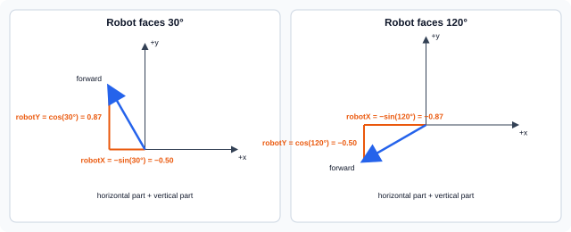

# Session 8 — Drive in the Direction the Robot Faces

In this session, W/A/S/D movement will follow the direction the robot is facing. You will connect angles, sine, and cosine to movement you can see immediately.

Keep using this cycle:

```text
predict -> edit -> run -> observe
```

## 1. Start from your working game

Use Android Studio to pull any instructor updates, then open:

```text
core/src/main/java/org/ftcgame/RobotGame.java
```

Run the game and confirm that the arrow keys rotate the robot around its center while W/A/S/D remain screen-aligned.

> **Checkpoint:** The completed Session 7 game runs correctly.

## 2. Connect angles to directions

An angle tells us which way the robot faces, but changing `robotX` and `robotY` requires horizontal and vertical amounts. Sine and cosine connect those two descriptions.

### Degrees and radians

Degrees divide one complete turn into 360 parts. They are convenient for controls and drawing:

```text
0°   = up
90°  = left
180° = down
270° = right
```

Radians measure the same angles with a different unit. One complete turn is `2π` radians, and half a turn is `π` radians. Java's sine and cosine methods expect radians, while libGDX's drawing call expects degrees.

Java can perform the conversion for us:

```text
radians = degrees × π / 180
```

```java
double angleRadians = Math.toRadians(robotRotation);
```

`Math.toRadians(...)`, `Math.sin(...)`, and `Math.cos(...)` are part of standard Java rather than libGDX. The same methods are available when writing Java for an FTC robot.

### `float` and `double`

The game has used `float` for positions, speeds, and delta time because libGDX commonly uses that type. Java's `Math` methods use another decimal-number type named `double`. A `double` keeps more precision than a `float`.

We will keep the angle and direction calculations as `double` values for as long as possible. Only after the complete movement calculation will we convert its result back to the `float` type used by the robot position.

### Sine and cosine

For this upward-facing image, the robot's forward direction is:

```text
forward x = -sin(angle)
forward y =  cos(angle)
```

The robot's right direction is perpendicular to forward:

```text
right x = cos(angle)
right y = sin(angle)
```

The diagram splits the robot's forward direction into a horizontal part that changes `robotX` and a vertical part that changes `robotY`. It shows how sine and cosine calculate those parts at two different angles:



*The horizontal part uses negative sine, and the vertical part uses cosine.*

Use the formulas at two easy angles:

| Rotation | Sine | Cosine | Forward direction | Right direction |
|---|---:|---:|---:|---:|
| `0°` | `0` | `1` | `(0, 1)` — up | `(1, 0)` — right |
| `90°` | `1` | `0` | `(-1, 0)` — left | `(0, 1)` — up |

At `0°`, the robot faces up. W moves up, and D moves toward screen-right.

At `90°`, the robot has turned counterclockwise and faces left. The forward x component is `-sin(90°)`, or `-1`, so W moves toward screen-left. The minus sign is necessary because positive x points right.

The robot's right side now points toward the top of the screen. The right-direction components are `(cos(90°), sin(90°))`, or `(0, 1)`, so D moves up.

## 3. Calculate movement for this frame

Replace the complete `moveRobot(...)` method with this version. W and S will become robot-relative first. A and D will remain screen-aligned for one more experiment.

```java
private void moveRobot(float deltaTime) {
    if (Gdx.input.isKeyPressed(Input.Keys.LEFT)) {
        robotRotation = robotRotation + ROBOT_ROTATION_SPEED * deltaTime;
    }

    if (Gdx.input.isKeyPressed(Input.Keys.RIGHT)) {
        robotRotation = robotRotation - ROBOT_ROTATION_SPEED * deltaTime;
    }

    double angleRadians = Math.toRadians(robotRotation);
    double sine = Math.sin(angleRadians);
    double cosine = Math.cos(angleRadians);

    double directionX = 0;
    double directionY = 0;

    if (Gdx.input.isKeyPressed(Input.Keys.W)) {
        directionX = directionX - sine;
        directionY = directionY + cosine;
    }

    if (Gdx.input.isKeyPressed(Input.Keys.S)) {
        directionX = directionX + sine;
        directionY = directionY - cosine;
    }

    if (Gdx.input.isKeyPressed(Input.Keys.A)) {
        robotX = robotX - ROBOT_SPEED * deltaTime;
    }

    if (Gdx.input.isKeyPressed(Input.Keys.D)) {
        robotX = robotX + ROBOT_SPEED * deltaTime;
    }

    robotX = (float) (robotX + directionX * ROBOT_SPEED * deltaTime);
    robotY = (float) (robotY + directionY * ROBOT_SPEED * deltaTime);
}
```

The replacement method should remain after `drawProjectiles()` and before `pause()`:

```java
private void drawProjectiles() {
    // Draw every projectile.
}

private void moveRobot(float deltaTime) {
    // Rotate, calculate a direction, and move the robot.
}

@Override
public void pause() {
```

`directionX` and `directionY` do not store the robot's position or a distance in pixels. They describe the movement direction for this frame:

- `directionX` describes the horizontal part of the direction;
- `directionY` describes the vertical part.

Both variables start at `0` every time `moveRobot(...)` runs. If neither W nor S is pressed, they remain `0`, so this direction calculation adds nothing to the robot's position. A and D still use their earlier screen-aligned statements at this point.

For example, when the robot faces `0°`, sine is `0` and cosine is `1`. Pressing W produces:

```text
directionX = 0 - 0 = 0
directionY = 0 + 1 = 1
```

The direction `(0, 1)` points straight up. Pressing S performs the opposite additions and produces `(0, -1)`, which points down.

After the input checks, these lines turn the direction into movement measured in pixels:

```java
robotX = (float) (robotX + directionX * ROBOT_SPEED * deltaTime);
robotY = (float) (robotY + directionY * ROBOT_SPEED * deltaTime);
```

The calculation follows this order:

```text
direction × pixels per second × seconds = pixels moved this frame
```

Java calculates the new coordinates as `double` values because `directionX` and `directionY` are `double`. The `(float)` cast converts each completed coordinate back to the `float` type used by `robotX` and `robotY`.

### Run it now

Run the game and test these predictions:

1. At `0°`, W moves up and S moves down.
2. Turn approximately `90°` counterclockwise. W moves left and S moves right.
3. At the same `90°` angle, A and D still move left and right on the screen.

The third result should now feel wrong: strafing should also follow the robot. That is the next change.

> **Checkpoint:** W and S follow the robot's forward direction, while A and D are temporarily still screen-aligned.

## 4. Make strafing robot-relative

Inside `moveRobot(...)`, replace the complete A and D statements with these versions:

```java
if (Gdx.input.isKeyPressed(Input.Keys.A)) {
    directionX = directionX - cosine;
    directionY = directionY - sine;
}

if (Gdx.input.isKeyPressed(Input.Keys.D)) {
    directionX = directionX + cosine;
    directionY = directionY + sine;
}
```

The four translation checks and final position update should now look like this:

```java
if (Gdx.input.isKeyPressed(Input.Keys.W)) {
    directionX = directionX - sine;
    directionY = directionY + cosine;
}

if (Gdx.input.isKeyPressed(Input.Keys.S)) {
    directionX = directionX + sine;
    directionY = directionY - cosine;
}

if (Gdx.input.isKeyPressed(Input.Keys.A)) {
    directionX = directionX - cosine;
    directionY = directionY - sine;
}

if (Gdx.input.isKeyPressed(Input.Keys.D)) {
    directionX = directionX + cosine;
    directionY = directionY + sine;
}

robotX = (float) (robotX + directionX * ROBOT_SPEED * deltaTime);
robotY = (float) (robotY + directionY * ROBOT_SPEED * deltaTime);
```

D adds the robot's right direction, `(cosine, sine)`. A subtracts that direction to move left.

### Predict, then run

Face the robot approximately `90°` counterclockwise so it points left. Before pressing the keys, predict the screen direction for each control:

- W drives forward, toward screen-left.
- S drives backward, toward screen-right.
- A strafes toward the robot's left side, which is screen-down.
- D strafes toward the robot's right side, which is screen-up.

Run the game and check all four predictions. Then turn to several other angles and try moving while turning.

> **Checkpoint:** W/S drive along the robot's facing direction, and A/D strafe across it.

Holding two translation keys still combines both directions, as it did in earlier sessions.

## 5. Observe what rotation did not change

Rotation changed the robot's drawing and movement. It did not automatically change every system that uses the robot.

### Projectiles still travel screen-upward

Collect one ball, turn the robot sideways, and press the Space key. Predict the result before firing.

The projectile still appears as if the robot were facing up and travels toward the top of the screen. The firing code still creates it at the center of the robot's top edge:

```java
new Projectile(
    robotX + (ROBOT_SIZE - Projectile.SIZE) / 2,
    robotY + ROBOT_SIZE
)
```

The projectile's `update(...)` method still changes only its `y` coordinate. Neither piece of code uses `robotRotation` yet. Keep both unchanged. Making projectiles start and travel in the facing direction is an improvement for a later session.

### The collision box does not rotate

The robot's collision method still treats it as an axis-aligned square. Its lower-left corner is `(robotX, robotY)`, and its other edges are calculated with `ROBOT_SIZE`. **Axis-aligned** means its sides remain parallel to the screen edges.

We can make the collision rectangles visible instead of guessing where they are. libGDX's `ShapeRenderer` draws simple shapes such as lines and rectangles. We will add a `drawHitboxes()` method to the game so holding H can show the hitboxes whenever collision behavior needs debugging.

Add these imports below the `Texture` and `SpriteBatch` imports:

```java
import com.badlogic.gdx.graphics.Color;
import com.badlogic.gdx.graphics.glutils.ShapeRenderer;
```

The drawing imports should now include `Color` and `ShapeRenderer` like this:

```java
import com.badlogic.gdx.graphics.Color;
import com.badlogic.gdx.graphics.Texture;
import com.badlogic.gdx.graphics.g2d.BitmapFont;
import com.badlogic.gdx.graphics.g2d.SpriteBatch;
import com.badlogic.gdx.graphics.glutils.ShapeRenderer;
import com.badlogic.gdx.math.Vector2;
```

Add this member variable immediately below `batch`:

```java
private ShapeRenderer shapeRenderer;
```

The drawing-resource variables should now begin like this:

```java
private SpriteBatch batch;
private ShapeRenderer shapeRenderer;
private Texture robotTexture;
```

Create the shape renderer in `create()` immediately after creating the sprite batch:

```java
shapeRenderer = new ShapeRenderer();
```

The beginning of `create()` should now look like this:

```java
public void create() {
    batch = new SpriteBatch();
    shapeRenderer = new ShapeRenderer();
    robotTexture = new Texture("robot.png");
```

Add this complete method after `moveRobot(...)` and before `pause()`:

```java
private void drawHitboxes() {
    shapeRenderer.setProjectionMatrix(batch.getProjectionMatrix());
    shapeRenderer.begin(ShapeRenderer.ShapeType.Line);

    shapeRenderer.setColor(Color.YELLOW);
    shapeRenderer.rect(robotX, robotY, ROBOT_SIZE, ROBOT_SIZE);

    shapeRenderer.setColor(Color.RED);
    shapeRenderer.rect(obstacleX, obstacleY, OBSTACLE_SIZE, OBSTACLE_SIZE);

    shapeRenderer.end();
}
```

The new debugging method should sit between movement and `pause()` like this:

```java
    robotX = (float) (robotX + directionX * ROBOT_SPEED * deltaTime);
    robotY = (float) (robotY + directionY * ROBOT_SPEED * deltaTime);
}

private void drawHitboxes() {
    // Draw the robot and obstacle collision rectangles.
}

@Override
public void pause() {
```

`ShapeType.Line` draws only the rectangle outlines. libGDX provides named color constants, so `Color.YELLOW` and `Color.RED` state the intended colors directly.

`setProjectionMatrix(...)` gives `ShapeRenderer` the same screen coordinate system as `SpriteBatch`, so both tools place `(robotX, robotY)` at the same point.

In `render()`, add this condition immediately after `batch.end()`:

```java
if (Gdx.input.isKeyPressed(Input.Keys.H)) {
    drawHitboxes();
}
```

The end of the drawing section should now look like this:

```java
font.draw(batch, "Ammo: " + ammo, HUD_X, Gdx.graphics.getHeight() - AMMO_TOP_MARGIN);
batch.end();

if (Gdx.input.isKeyPressed(Input.Keys.H)) {
    drawHitboxes();
}
```

The hitboxes are drawn after `batch.end()` because `SpriteBatch` and `ShapeRenderer` cannot draw at the same time.

Finally, add this cleanup call to `dispose()` immediately after disposing the batch:

```java
shapeRenderer.dispose();
```

The cleanup method should now begin like this:

```java
public void dispose() {
    batch.dispose();
    shapeRenderer.dispose();
    robotTexture.dispose();
```

### Run it now

Run the game and hold H. A yellow outline should show the robot hitbox, and a red outline should show the obstacle hitbox.

Keep holding H while turning the robot diagonally. The image rotates, but the yellow rectangle stays parallel to the screen edges. The game detects a collision when the yellow and red hitboxes overlap, not when the visible artwork touches. At some angles, the rotated robot image may appear to touch the obstacle before its yellow hitbox does. Rotating the hitbox with the image would require substantially more geometry and is not needed for this game.

Approach the obstacle while holding H. The robot should stop with the yellow and red outlines touching. Movement can produce a brief overlap during the frame, but the collision response places the robot against the approached edge before drawing. The robot's angle should remain unchanged because position and rotation are separate pieces of state.

> **Checkpoint:** Holding H displays both hitboxes, the robot hitbox remains axis-aligned, and collision leaves the robot touching the approached obstacle edge.

## 6. Test the complete game

Before saving your work, verify every required behavior:

1. Left Arrow rotates the robot counterclockwise.
2. Right Arrow rotates the robot clockwise.
3. Rotation remains smooth and uses `ROBOT_ROTATION_SPEED * deltaTime`.
4. The robot image turns around its center.
5. At several angles, W/S move forward and backward relative to the robot.
6. At several angles, A/D strafe left and right relative to the robot.
7. Movement still uses `ROBOT_SPEED * deltaTime`.
8. `moveRobot(deltaTime)` contains the robot input and movement calculations.
9. Angle, sine, cosine, `directionX`, and `directionY` calculations remain `double` until the completed coordinates are cast back to `float`.
10. Holding H calls `drawHitboxes()` and displays the robot hitbox in yellow and the obstacle hitbox in red.
11. The robot hitbox remains axis-aligned while the robot image rotates.
12. When the two hitboxes overlap during movement, the robot is placed flush against the approached obstacle edge.
13. Collecting balls, ammunition, scoring, and projectile removal still work.
14. Fired balls still start as if the robot were facing up and travel screen-upward.
15. `shapeRenderer` is disposed when the game closes.
Ask for help if any check fails. Use a known angle, predict its directions, and inspect one calculation at a time. Fix the game and repeat the checklist before committing.

## 7. Commit and push

Use Android Studio's Git tools:

1. Open the Commit window.
2. Confirm that `RobotGame.java` is the only Java file changed.
3. Review the highlighted changes.
4. Enter this commit message:

   ```text
   Add robot-relative movement and hitbox debugging
   ```

5. Commit the changes.
6. Push the commit to your assigned GitHub repository.

> **Final checkpoint:** The finished game works, and the `Add robot-relative movement and hitbox debugging` commit has been pushed.
