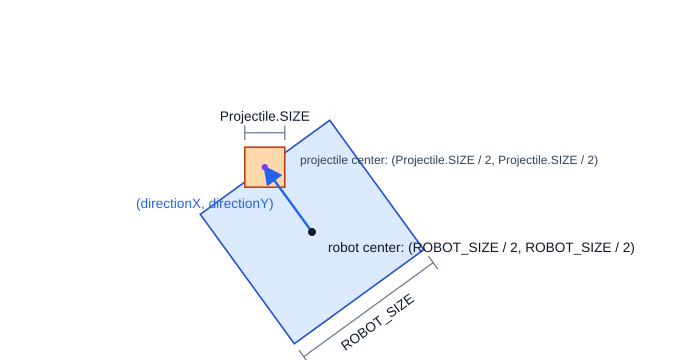
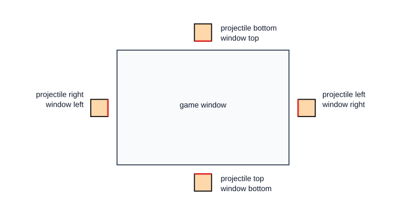

# Session 9 — Aim and Fire in Any Direction

In this session, the Space key will fire from the front of the robot in the direction it faces. Every projectile will remember its own direction, even after the robot turns. Shots will score in the goal, stop at the obstacle, or disappear after leaving any edge of the window.

Keep using this cycle:

```text
predict -> edit -> run -> observe
```

When surrounding code is shown, copy only the code in the first, copy-only block. The second block shows where that code belongs.

## 1. Start from your working game

Use Android Studio to pull any instructor updates, then open:

```text
core/src/main/java/org/ftcgame/RobotGame.java
```

Run the game and confirm that:

- W/S drive forward and backward relative to the robot;
- A/D strafe left and right relative to the robot;
- Left and Right Arrow rotate the robot;
- touching the obstacle stops the robot flush against the approached edge;
- collecting balls increases ammunition;
- the Space key fires one ball per press when ammunition is available;
- an upward shot can score in the goal;
- holding H displays the axis-aligned robot and obstacle hitboxes.

Now collect a ball, turn the robot sideways, and press the Space key. The projectile still starts as if the robot were facing up and travels toward the top of the screen. Session 8 rotated the robot's drawing and movement, but the projectile code still ignores `robotRotation`.

Stop the game before editing.

> **Checkpoint:** The completed Session 8 game works, and firing sideways exposes the upward-only limitation.

## 2. Reuse the robot's forward direction

Session 8 converted the robot's angle from degrees to radians, calculated `sine` and `cosine`, and used them to change `directionX` and `directionY` when W was pressed:

```java
directionX = directionX - sine;
directionY = directionY + cosine;
```

Because `directionX` and `directionY` start at `0`, familiar angles produce:

| Robot rotation | `(directionX, directionY)` | Shot travels |
|---|---:|---|
| `0°` | `(0, 1)` | up |
| `90°` | `(-1, 0)` | left |
| `180°` | `(0, -1)` | down |
| `-90°` | `(1, 0)` | right |

The robot's rotation is stored in degrees because the drawing call uses degrees. Java's sine and cosine methods expect radians, so firing will use `Math.toRadians(...)` just as movement does.

The firing code needs the direction for two related jobs:

1. finding the front of the rotated robot;
2. telling the new projectile which way to move.

We will calculate the direction once when the Space key is pressed and pass the components into the projectile object.

## 3. Calculate the projectile's starting position

`robotX` and `robotY` locate the robot's lower-left corner. Add half of `ROBOT_SIZE` to each coordinate to reach the center. From there, move another half of `ROBOT_SIZE` along `directionX` and `directionY` to reach the front edge.

The projectile should be centered on that point.

```text
projectile x = robotX + ROBOT_SIZE / 2
    + directionX × ROBOT_SIZE / 2
    - Projectile.SIZE / 2
projectile y = robotY + ROBOT_SIZE / 2
    + directionY × ROBOT_SIZE / 2
    - Projectile.SIZE / 2
```

At `0°`, the horizontal calculation centers the projectile across the robot, and the vertical calculation places its center on the robot's top edge. The projectile overlaps the front edge by half its size because its center sits exactly on that edge.



*Move half of `ROBOT_SIZE` from the robot center along `directionX`, `directionY`, then center the projectile on that point.*

We will keep these calculations as `double` values. Java's `Math` methods return `double`, and converting earlier would discard precision before the calculation is complete.

## 4. Give every projectile its own direction

Open *Projectile.java*:

```text
core/src/main/java/org/ftcgame/Projectile.java
```

Add these fields immediately below `y`:

```java
private double directionX;
private double directionY;
```

Your projectile fields should now look like this:

```java
public static final int SIZE = 16;
private static final float SPEED = 400;

private float x;
private float y;
private double directionX;
private double directionY;
```

Each `Projectile` object already has independent position fields. The new fields will give it an independent direction too. They use `double` so the sine-and-cosine components keep their precision.

Replace the complete constructor with this version:

```java
public Projectile(
    float startX,
    float startY,
    double startDirectionX,
    double startDirectionY) {
    x = startX;
    y = startY;
    directionX = startDirectionX;
    directionY = startDirectionY;
}
```

The constructor should remain between the fields and `update(...)`:

```java
private double directionX;
private double directionY;

public Projectile(
    float startX,
    float startY,
    double startDirectionX,
    double startDirectionY) {
    x = startX;
    y = startY;
    directionX = startDirectionX;
    directionY = startDirectionY;
}

public void update(float deltaTime) {
```

The constructor now requires four arguments. The first two set the projectile's starting position. The last two capture the direction in which the projectile will move.

Android Studio will show an error in `RobotGame.java` because its existing `new Projectile(...)` call supplies only two arguments. That is expected until we update the call.

## 5. Calculate direction when the Space key is pressed

Return to `RobotGame.java`.

In `RobotGame.java`, find `render()`. Replace the complete Space key firing condition between the robot-obstacle collision check and `collectBalls();` with this version:

```java
if (Gdx.input.isKeyJustPressed(Input.Keys.SPACE) && ammo > 0) {
    double angleRadians = Math.toRadians(robotRotation);
    double sine = Math.sin(angleRadians);
    double cosine = Math.cos(angleRadians);

    double directionX = 0;
    double directionY = 0;

    directionX = directionX - sine;
    directionY = directionY + cosine;

    double projectileStartX = robotX + ROBOT_SIZE / 2
        + directionX * ROBOT_SIZE / 2
        - Projectile.SIZE / 2;
    double projectileStartY = robotY + ROBOT_SIZE / 2
        + directionY * ROBOT_SIZE / 2
        - Projectile.SIZE / 2;

    projectiles.add(new Projectile(
        (float) projectileStartX,
        (float) projectileStartY,
        directionX,
        directionY
    ));
    ammo = ammo - 1;
}
```

The firing condition should remain after robot movement and obstacle response so it uses the robot's final position:

```java
moveRobot(deltaTime);

if (isRobotTouching(obstacleX, obstacleY, OBSTACLE_SIZE)) {
    // The existing edge-snapping response remains here.
}

if (Gdx.input.isKeyJustPressed(Input.Keys.SPACE) && ammo > 0) {
    // Calculate the direction and starting position, create one projectile,
    // and spend one ammunition.
}

collectBalls();
```

The `angleRadians`, `sine`, `cosine`, `directionX`, and `directionY` calculation is the same one `moveRobot(...)` uses for forward movement. Here, it runs when the Space key is pressed, and the new `Projectile` stores the resulting direction.

Do not run yet. The projectile receives a direction, but its current `update(...)` method still changes only `y`.

## 6. Move in the stored direction

Return to `Projectile.java`. Replace the complete `update(...)` method:

```java
public void update(float deltaTime) {
    x = (float) (x + directionX * SPEED * deltaTime);
    y = (float) (y + directionY * SPEED * deltaTime);
}
```

The updated method should remain before the position getters:

```java
public void update(float deltaTime) {
    x = (float) (x + directionX * SPEED * deltaTime);
    y = (float) (y + directionY * SPEED * deltaTime);
}

public float getX() {
```

Both coordinate calculations follow the familiar relationship:

```text
direction × pixels per second × seconds = pixels moved this frame
```

The expression becomes a `double` because each direction field is a `double`. Each `(float)` cast happens only after Java calculates the complete new coordinate.

### Run it now

Run the game and collect enough balls for three shots. Test them one at a time:

1. At `0°`, fire upward.
2. Turn approximately `90°` counterclockwise and fire left.
3. Turn to another angle and fire, then immediately turn the robot away.

The third projectile should continue along the direction stored when it was fired. Turning changes `robotRotation`, but it does not change the private direction fields of an existing projectile.

Projectiles fired down, left, or right do not disappear yet. The old removal method checks only whether a projectile is above the window.

> **Checkpoint:** Projectiles start at the rotated robot's front and keep their independently stored directions.

## 7. Detect every window edge

The existing `isAbove(...)` method handles only upward shots. In `Projectile.java`, replace it with a new method named `isOutside(...)`:

```java
public boolean isOutside(float width, float height) {
    return x + SIZE < 0 ||
        x > width ||
        y + SIZE < 0 ||
        y > height;
}
```

The end of `Projectile.java` should now contain the collision and boundary methods:

```java
public boolean isTouching(float objectX, float objectY, float objectSize) {
    return x < objectX + objectSize &&
        x + SIZE > objectX &&
        y < objectY + objectSize &&
        y + SIZE > objectY;
}

public boolean isOutside(float width, float height) {
    return x + SIZE < 0 ||
        x > width ||
        y + SIZE < 0 ||
        y > height;
}
```

`x` and `y` locate the projectile's lower-left corner. Adding its width to `x` gives its right edge, and adding its height to `y` gives its top edge. We compare the projectile's right edge with the window's left edge to check whether it has left the window on the left. We compare the projectile's top edge with the window's bottom edge to check whether it has left at the bottom.

The `||` operator means **or**. `isOutside(...)` returns `true` when any one of these statements is true:

- the projectile's right edge is left of the window's left edge;
- its left edge is right of the window's right edge;
- its top edge is below the window's bottom edge;
- its bottom edge is above the window's top edge.



*Each comparison uses the projectile edge that must pass the window edge before the complete projectile is outside.*

Android Studio will now mark the old `isAbove(...)` call in `RobotGame.java` as an error. We will replace it while adding obstacle collision.

## 8. Block projectiles with the obstacle

Open `RobotGame.java`. Replace the complete `updateProjectiles(...)` method with:

```java
private void updateProjectiles(float deltaTime) {
    for (int i = projectiles.size() - 1; i >= 0; i = i - 1) {
        Projectile projectile = projectiles.get(i);
        projectile.update(deltaTime);

        if (projectile.isTouching(obstacleX, obstacleY, OBSTACLE_SIZE)) {
            projectiles.remove(i);
        } else if (projectile.isTouching(goalX, goalY, GOAL_SIZE)) {
            projectiles.remove(i);
            score = score + 1;
        } else if (projectile.isOutside(
            Gdx.graphics.getWidth(),
            Gdx.graphics.getHeight()
        )) {
            projectiles.remove(i);
        }
    }
}
```

The update method should remain between the ball-drawing and projectile-drawing methods:

```java
private void drawBalls() {
    // Draw every collectible ball.
}

private void updateProjectiles(float deltaTime) {
    // Move backward through the projectiles, update each one,
    // and remove obstacle hits, scores, or off-screen shots.
}

private void drawProjectiles() {
```

The loop still moves backward, so removing one projectile cannot skip another unchecked projectile.

After movement, the `if`/`else if` chain gives each projectile one result per frame:

1. touching the obstacle removes it without changing the score;
2. otherwise, touching the goal removes it and adds one point;
3. otherwise, leaving any window edge removes it without scoring.

### Run it now

Collect the balls and test three outcomes:

1. Aim through the obstacle. The projectile should disappear on contact, and the score should not change.
2. Aim into the goal without hitting the obstacle. The projectile should disappear and award exactly one point.
3. Aim away from both. The projectile should disappear only after it completely leaves the window.

Repeat the missed-shot test toward at least two different edges.

> **Checkpoint:** Obstacle hits do not score, goal hits score once, and misses disappear beyond every edge.

## 9. Inspect one firing calculation

Use a controlled experiment when a projectile starts or travels in an unexpected direction. In `RobotGame.java`, find `render()`. Inside its Space key condition, temporarily add this log immediately after calculating `projectileStartY`:

```java
Gdx.app.log("FIRING", "degrees=" + robotRotation
    + " directionX=" + directionX
    + " directionY=" + directionY
    + " startX=" + projectileStartX
    + " startY=" + projectileStartY);
```

The temporary log should sit between the starting-position calculation and object creation:

```java
double projectileStartX = robotX + ROBOT_SIZE / 2
    + directionX * ROBOT_SIZE / 2
    - Projectile.SIZE / 2;
double projectileStartY = robotY + ROBOT_SIZE / 2
    + directionY * ROBOT_SIZE / 2
    - Projectile.SIZE / 2;

Gdx.app.log("FIRING", "degrees=" + robotRotation
    + " directionX=" + directionX
    + " directionY=" + directionY
    + " startX=" + projectileStartX
    + " startY=" + projectileStartY);

projectiles.add(new Projectile(
```

Run the game without turning the robot. Collect and fire one ball at `0°`. In Android Studio's Run window, check that:

- `directionX` is `-0.0` or very close to `0`;
- `directionY` is `1.0`;
- the starting position places the projectile's center on the robot's front edge.

The negative sign in `-0.0` does not change the direction; it behaves as zero.

If the visible shot disagrees with the numbers, inspect the constructor assignments and `update(...)`. If the numbers themselves are wrong, inspect the sine, cosine, and signs in the firing block. Change one line at a time, run again, and compare the new observation.

Remove the temporary log after the experiment.

## 10. Test independent projectiles

To make independent stored state visible:

1. Collect at least two balls.
2. Fire the first ball upward.
3. Turn quickly and fire the second ball sideways while the first remains visible.
4. Turn again without firing.

The two projectiles should continue along different straight paths. Neither should curve when the robot turns.

Each call to `new Projectile(...)` copied that firing event's direction into a different object. The collection stores the objects together, but every object updates its own position with its own fields.

> **Checkpoint:** Several active projectiles can travel in different stored directions at the same time.

## 11. Check the complete game

Before saving your work, verify every required behavior:

1. Left and Right Arrow still rotate the robot with delta time.
2. W/S still drive relative to the robot, and A/D still strafe relative to it.
3. Touching the obstacle still places the robot flush against the approached edge without changing its rotation.
4. Collecting each ball increases ammunition by one.
5. The Space key fires once per press only when ammunition is available.
6. A projectile is centered on the front edge of the rotated robot.
7. Each projectile stores its own `double` x/y direction components.
8. Starting-position calculations remain `double` until completed coordinates are passed across the `float` boundary.
9. `Projectile.update(...)` changes both coordinates using direction, speed, and delta time.
10. Turning after firing does not change an existing projectile's path.
11. A projectile disappears without scoring when it touches the obstacle.
12. A projectile disappears and awards exactly one point when it enters the goal.
13. Projectiles disappear after completely leaving the left, right, bottom, or top edge.
14. `updateProjectiles(...)` uses the existing backward loop and one obstacle-goal-window `if`/`else if` chain.
15. Robot, obstacle, goal, and projectile collisions remain axis-aligned rectangles.
16. Holding H still displays the Session 8 robot and obstacle hitboxes.
17. No temporary firing log remains.

Ask for help if any check fails. Use a cardinal angle, predict the direction components, and compare one calculation at a time. Fix the game and repeat the checklist before committing.

## 12. Commit and push

Use Android Studio's Git tools:

1. Open the Commit window.
2. Confirm that `RobotGame.java` and `Projectile.java` are the Java files you changed.
3. Review the highlighted changes.
4. Enter this commit message:

   ```text
   Add directional projectile firing
   ```

5. Commit the changes.
6. Push the commit to your assigned GitHub repository.

> **Final checkpoint:** The finished game works, and the `Add directional projectile firing` commit has been pushed.

## Optional customizations

If you finish early, make one change at a time:

- change projectile `SPEED` while keeping delta-time movement;
- use the temporary firing log at `90°` or `-90°`, then remove it;
- practice firing two projectiles in noticeably different directions;
- replace `balls/ball.png` with your own 128×128 transparent image at the same path.

Keep the `Projectile` constructor, stored direction components, collision methods, and `moveRobot(...)` structure unchanged for later sessions.
